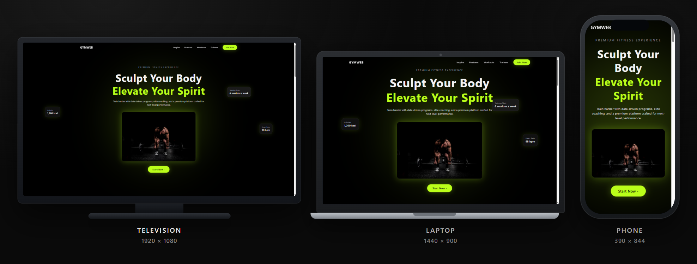
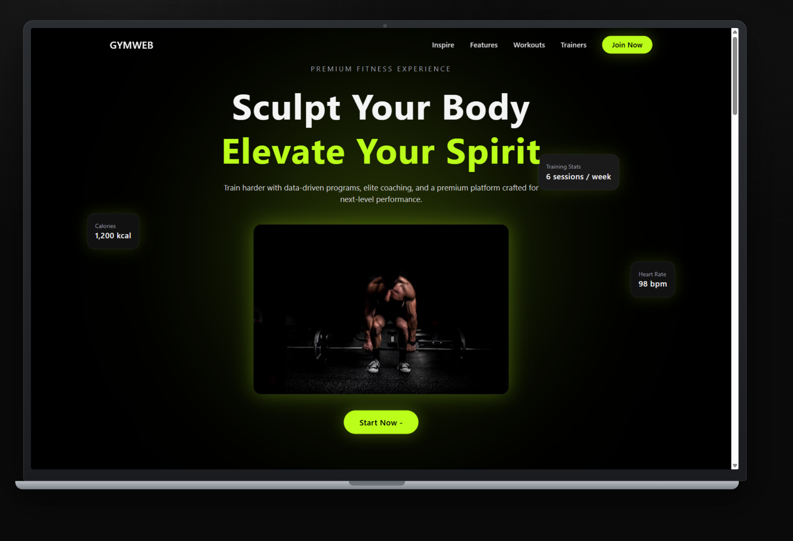
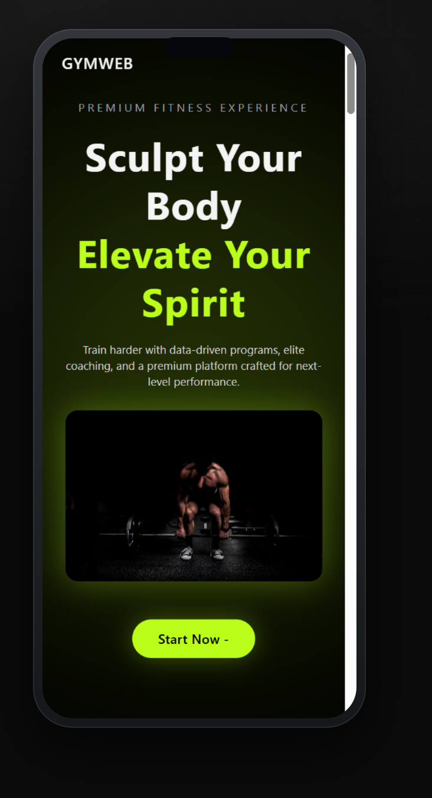
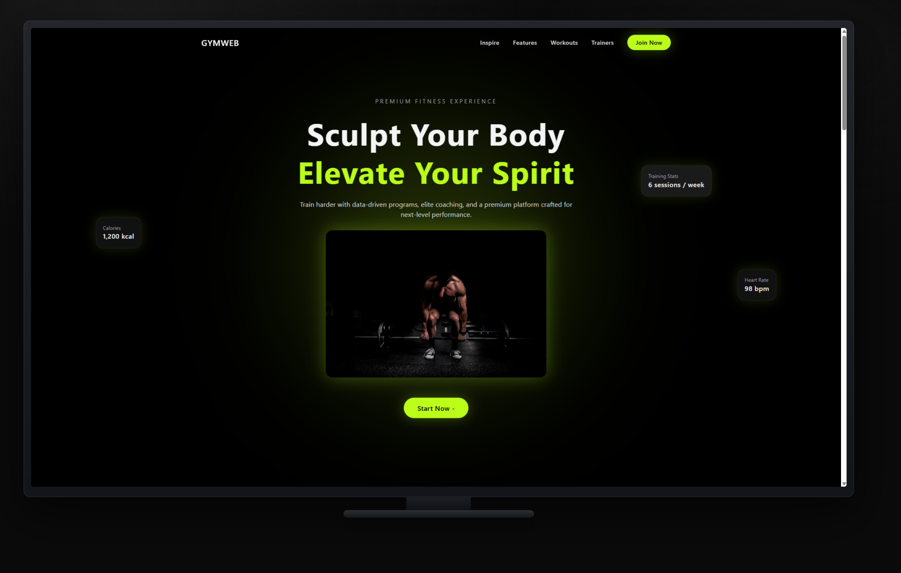
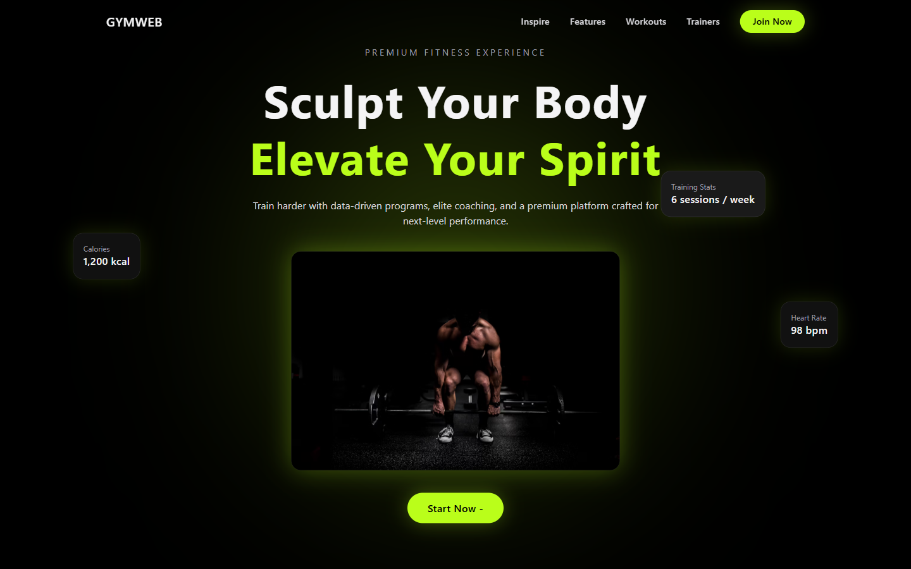
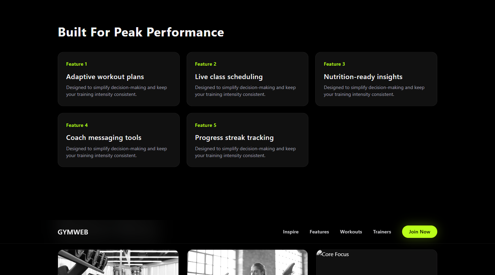
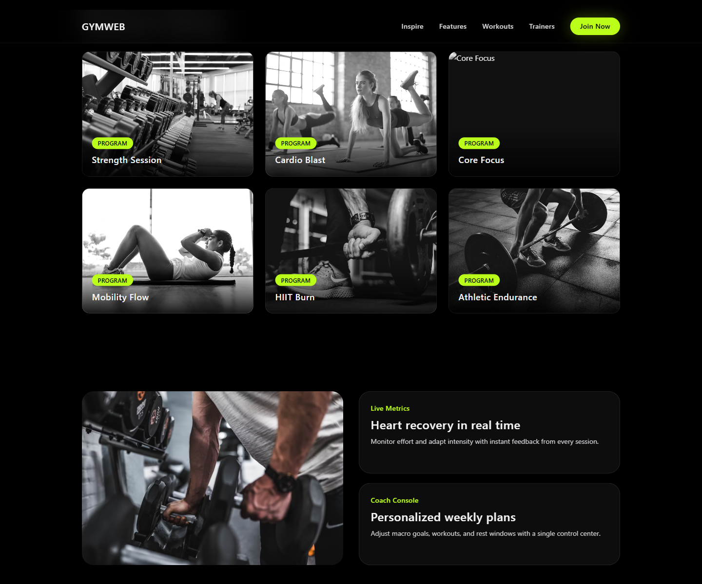
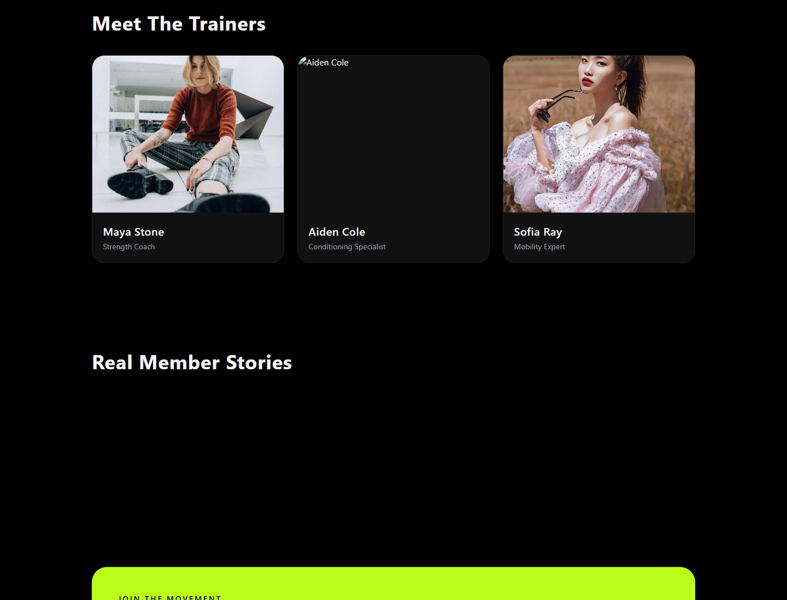

<div align="center">

# GymWeb — Sculpt Your Body

**Premium fitness marketing site** — adaptive workouts, live classes, trainer profiles, and a clean join flow.

Live: **[gymweb-sand.vercel.app](https://gymweb-sand.vercel.app/)**

[](https://nextjs.org)
[](https://react.dev)
[](https://www.typescriptlang.org)
[](https://tailwindcss.com)

</div>

<div align="center">
  
  <p><em>One site · three displays — television, laptop, and phone.</em></p>
</div>

---

## Why this exists

A sharp, dark-mode fitness landing experience — hero metrics, feature cards, workout library, trainers,
testimonials, and a clear “Join” CTA — built as a portfolio-ready Next.js frontend.

---

## What you can do

- **Hero with live-style metrics** — calories, heart rate, training sessions at a glance.
- **Feature grid** — adaptive plans, live scheduling, nutrition insights, coach messaging, streaks.
- **Workout library** — Strength, Cardio, Core, Mobility, HIIT, Endurance.
- **Meet the trainers** — coach cards with specialties.
- **Member stories** — social proof before the join form.
- **Works on every screen** — phone, laptop, and television layouts.

---

## See it on every display

| Laptop · 1440 × 900 | Phone · 390 × 844 |
| :---: | :---: |
|  |  |

<div align="center">

### Television · 1920 × 1080



</div>

---

## Every feature, one by one

### 1 · Hero



### 2 · Built for peak performance



### 3 · Workout library & coaching tools



### 4 · Trainers & member stories



---

## Tech stack

| Layer | Technology |
| --- | --- |
| Frontend | Next.js 16 · React · TypeScript · Tailwind · Framer Motion |
| Data | Prisma · PostgreSQL (optional backend features) |
| Deploy | Vercel |

---

## Getting started (run it locally)

```bash
git clone https://github.com/Nishanth1409/gymweb.git
cd gymweb
npm install
npm run dev
```

Open **http://localhost:3000**.

| Command | What it does |
| --- | --- |
| `npm run dev` | Next.js development server |
| `npm run build` | Production build |
| `npm run start` | Serve production build |

---

## Live & credits

| | |
| :--- | :--- |
| **Live** | [gymweb-sand.vercel.app](https://gymweb-sand.vercel.app/) |
| **Author** | [Nishanth K R](https://github.com/Nishanth1409) |
| **Portfolio** | [nkrportfolio.vercel.app](https://nkrportfolio.vercel.app) |

---

<div align="center">

*Son of a farmer · always a farmer.*

[GitHub](https://github.com/Nishanth1409) · [Portfolio](https://nkrportfolio.vercel.app)

</div>

